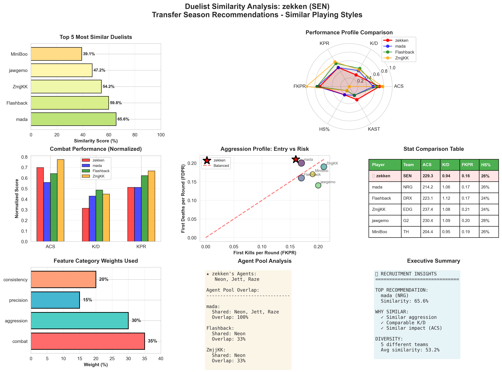

# 🎮 Valorant Esports Player Recommendation System

### Finding the Perfect Replacement: How ML Recommender Systems aid Valorant Transfers

 

It’s that time of year again. Rosters are shuffling, contracts are expiring, and team managers are frantically trying to figure out: “If we lose our star duelist, who the hell do we sign?”

Traditionally, this decision was made through scouting reports, scrims, and gut feelings. But what if we could do better? What if we could use data to find players who are genuinely similar in playstyle, not just in name recognition?

That’s exactly what I set out to explore using the Valorant Champions 2025 Paris tournament data. Spoiler: the results are pretty damn cool.

- ML-powered talent matching engine for professional esports using weighted 
cosine similarity. 
- Analyzes 9 performance metrics to identify statistically 
similar players for data-driven recruitment decisions.

🔹 Features:
- Content-based filtering with customizable feature weights
- Comprehensive EDA with correlation analysis & hypothesis testing
- 8-panel interactive dashboard with radar charts & performance comparisons
- Automated feature engineering & StandardScaler normalization

### 🛠️ Tech Stack: Python | pandas | scikit-learn | matplotlib | seaborn

### 📊 Dataset: 81 players, 88 matches, 224 economy records from international 
tournament data

### 💡 Use Case: Transfer season talent scouting, player archetype analysis, 
performance benchmarking
